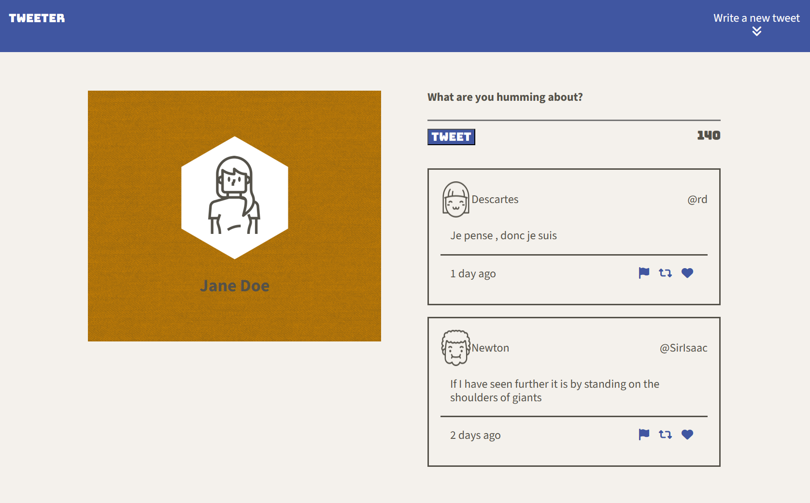
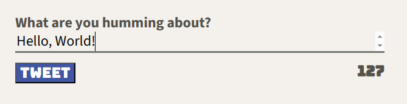
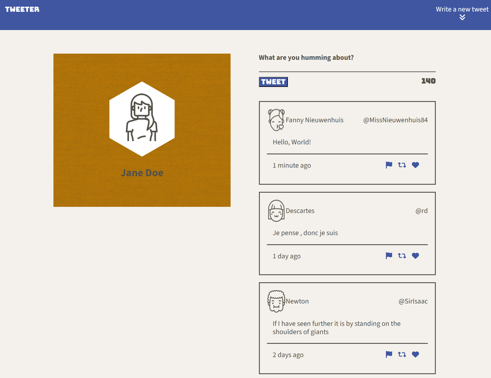
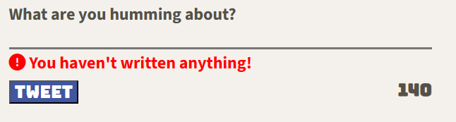
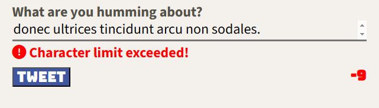
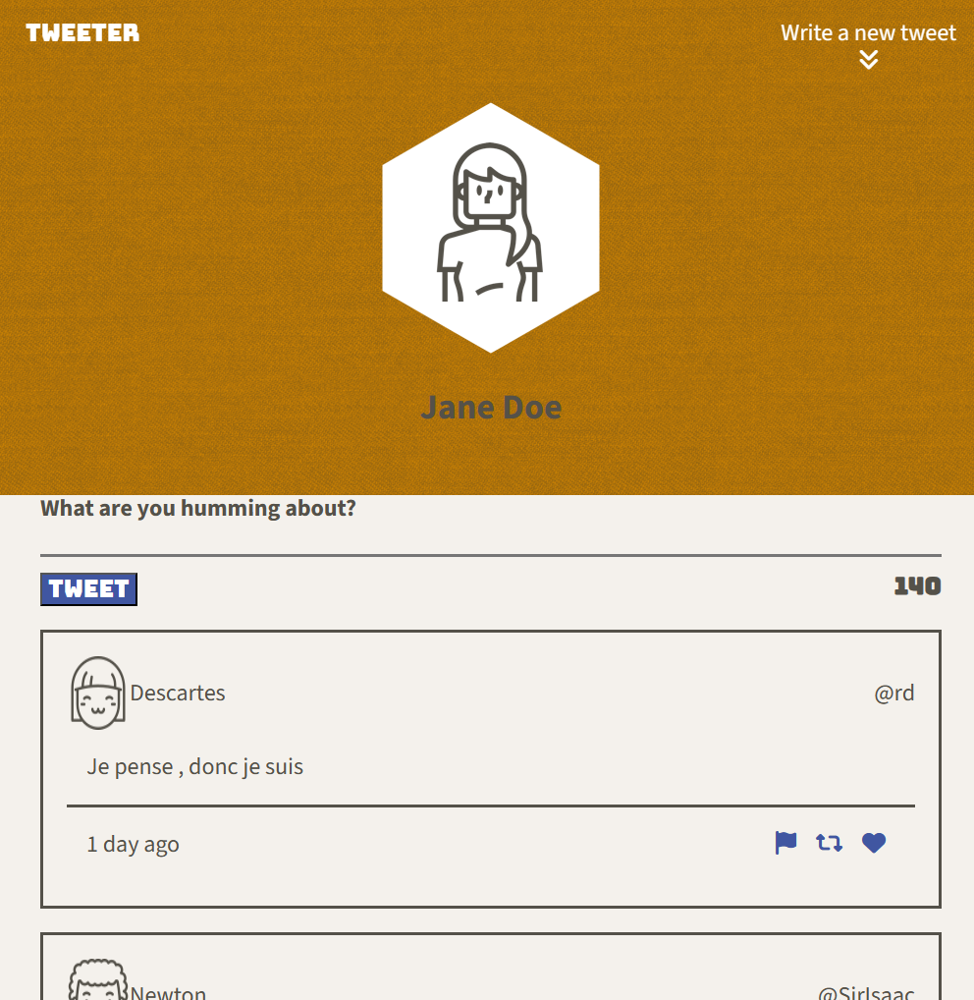

# Tweeter Project

Tweeter is a simple, single-page Twitter clone.

This repository is the starter code for the project: Students will fork and clone this repository, then build upon it to practice their HTML, CSS, JS, jQuery and AJAX front-end skills, and their Node, Express back-end skills.

## Getting Started

1. [Create](https://docs.github.com/en/repositories/creating-and-managing-repositories/creating-a-repository-from-a-template) a new repository using this repository as a template.
2. Clone your repository onto your local device.
3. Install dependencies using the `npm install` command.
3. Start the web server using the `npm run local` command. The app will be served at <http://localhost:8080/>.
4. Go to <http://localhost:8080/> in your browser.

## Dependencies

- Express
- Node 5.10.x or above

## Description\
 
<h3 style="text-align: center;">Welcome to Tweeter! A single-page Twitter clone.</h3> 
 

</img>
 
<h4 style="text-align: center;">We can type up our tweet like so:</h4>
 

</img>
 
<h4 style="text-align: center;">And it will display the text using a randomly generated profile:</h4>
 

</img>
 
<h4 style="text-align: center;">There's also error warnings as well. If you tweeted a message without any content in it 
or if the character limit has exceeded, an error warning will pop up. Check this out:</h4>
 

</img>
 

</img>
 
<h4 style="text-align: center;">Media queries were also used to display a more user friendly environment:</h4>
 

</img>
 
<h4 style="text-align: center;">Cool!</h4>
